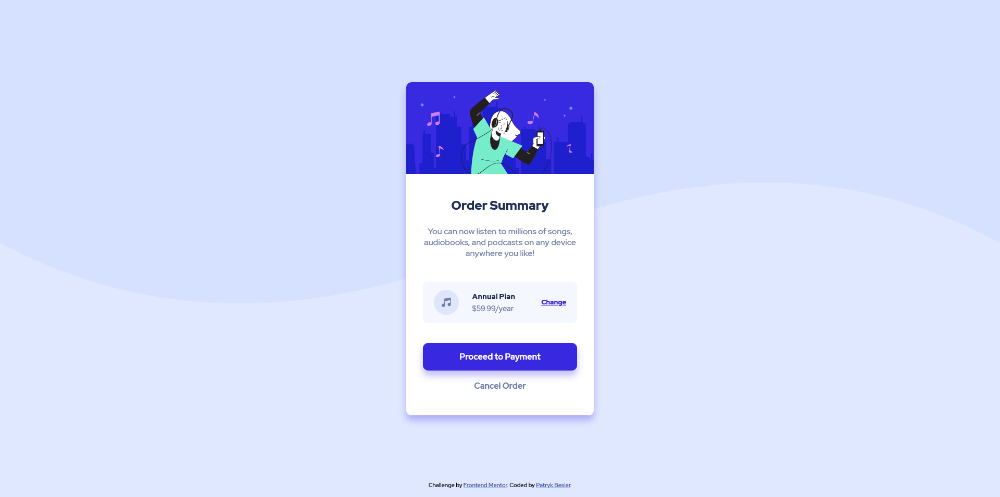

# Frontend Mentor - Order summary card solution

This is a solution to the [Order summary card challenge on Frontend Mentor](https://www.frontendmentor.io/challenges/order-summary-component-QlPmajDUj). Frontend Mentor challenges help you improve your coding skills by building realistic projects.

As most of my work, this solution is being constantly updated as I learn new things and find better solutions for my problems, so please, take this into consideration. :)

## Table of contents

-   [Overview](#overview)
    -   [The challenge](#the-challenge)
    -   [Screenshot](#screenshot)
    -   [Links](#links)
-   [My process](#my-process)
    -   [Built with](#built-with)
    -   [What I learned](#what-i-learned)
    -   [Continued development](#continued-development)
    -   [Useful resources](#useful-resources)
-   [Author](#author)

## Overview

### The challenge

Users should be able to:

-   See hover states for interactive elements

### Screenshot

### Links

-   [Solution](https://www.frontendmentor.io/solutions/order-summary-component-P9VMXQz7X)
-   [Live Site](https://beslerpatryk.github.io/order_summary_component/)

## My process

### Built with

-   Semantic HTML5 markup
-   CSS custom properties
-   Flexbox (for card's inner elements)
-   CSS Grid (for card's general layout)
-   Mobile-first workflow

### What I learned

-   I didn't learn anything particularly new but I was incredibly happy to see how much I improved in the past months. This challenge would've been a struggle a while ago. The biggest issue wasn't actually HTML and CSS. Instead it was git and uploading project to frontend mentor's website. It took me way to long to setup everything properly.
-   Create the repository on github first and then connect it using SSH link in git console. There is a way to create github repositories through command line but it requires to instal github command line or something like that.
-   When working with [github.io](http://github.io) hosting and frontend mentor make sure that cache of the browser is cleared. Also "Create New Screenshot" button on the frontend mentor project page is very helpful to generate new screenshot after committing some changes to the project.
-   Figure tag exists but it wouldn't be correct to use it in the context of this project since it is used for images that are somehow related to the content of the page, not for images that serve purely aesthetic function

### Continued development

I still struggle with finding the most elegant solution to simple problems. In future projects I will try to focus more on writing cleaner and easy to understand code as well as improve my skills in layout and positioning.

### Useful resources

-   [Semantic HTML Guide](https://www.w3schools.com/html/html5_semantic_elements.aspm) - This helped me better understand how to write semantically correct HTML. I really liked this guide because it is straight to the point. I will definiately be coming back to it.
-   [Responsive Web Design Guide](https://dev.to/romankhan/a-complete-guide-of-responsive-web-design-using-css-rem-and-em-units-4j6k) - This is an amazing article which helped me better understand responsive design using rem and em units. I'd recommend it to anyone still learning this concept.

## Author

-   Frontend Mentor - [@beslerpatryk](https://www.frontendmentor.io/profile/beslerpatryk)
-   Github - [@beslerpatryk](https://github.com/beslerpatryk)
